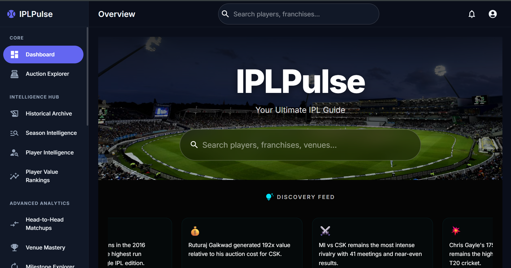
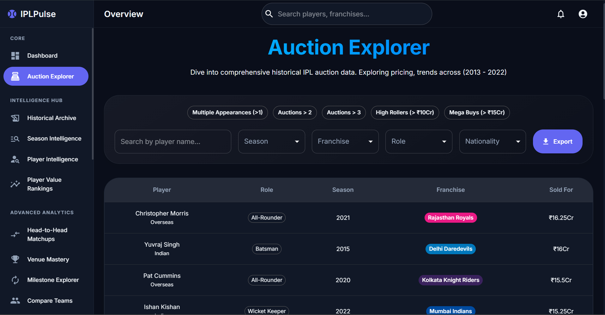
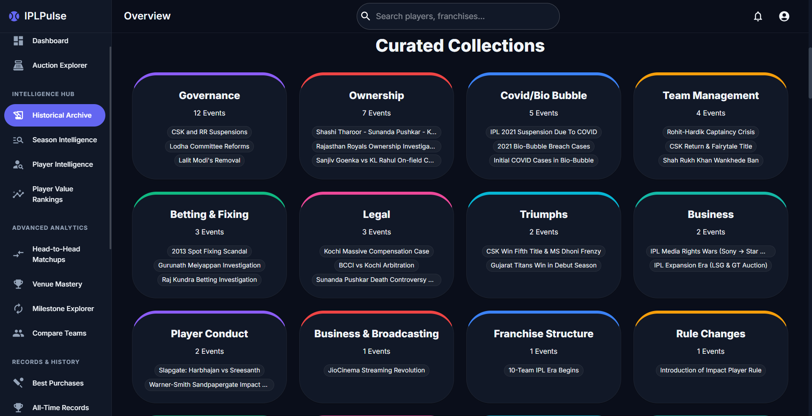
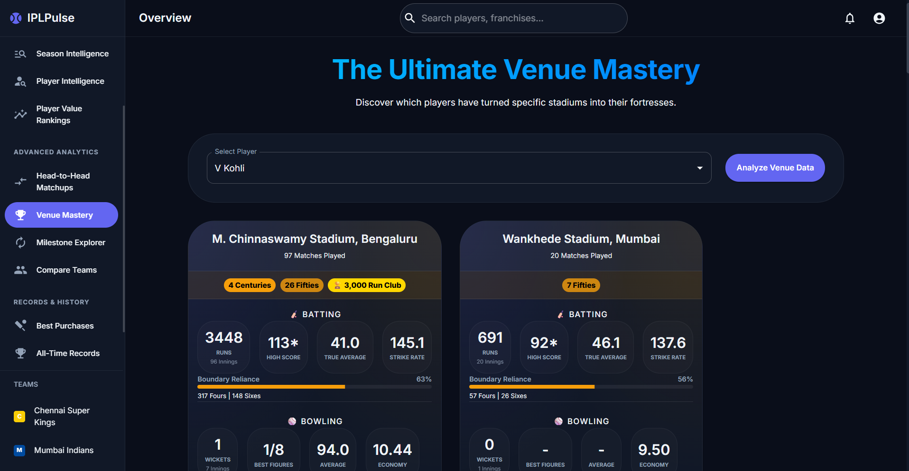
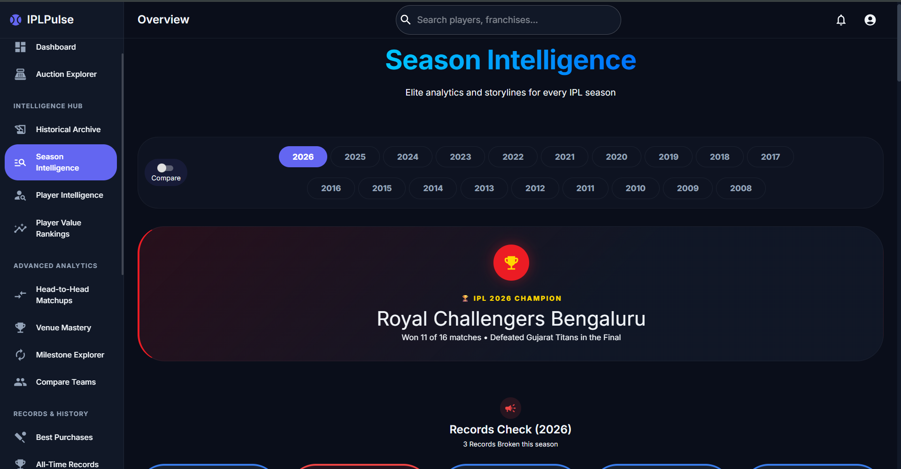
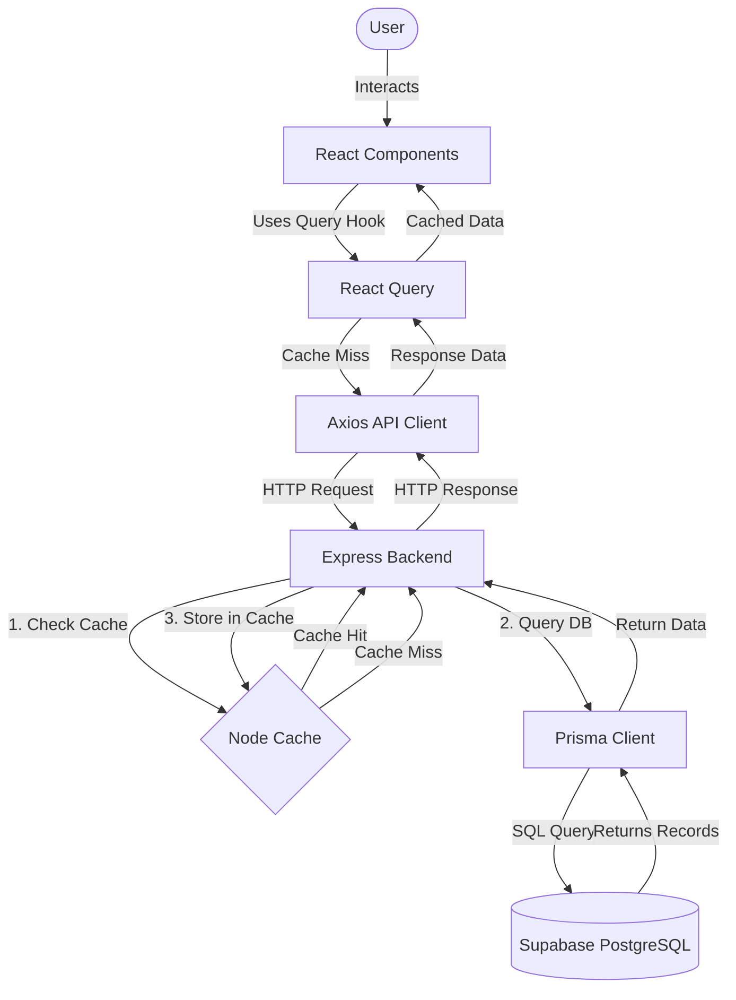

<h1 align="center">IPLPulse</h1>

  
  
  
  
  
  
  

  🔗 <b>Live Application</b>: <a href="https://ipl-pulse.netlify.app/" target="_blank" rel="noopener noreferrer">ipl-pulse.netlify.app/</a>

  IPLPulse is the Ultimate IPL Guide and analytics platform that allows users to explore auction datasets, analyze player values, evaluate venue mastery, visualize head-to-head matchups, inspect historical archives, browse season-on-season statistics, discover best purchases, check all-time tournament records, and more.

---

<h2 align="center">📸 Screenshots</h2>

    
    
    
    
  

---

<h2 align="center">📊 Dataset Scale & Metrics</h2>

IPLPulse is backed by a massive relational dataset compiled from official IPL auction ledgers and cricsheet ball-by-ball records:
* **19 IPL Seasons** (2008 – 2026 historical records)
* **1,200+ Matches** (fully ingested match summaries)
* **1,200+ Players** (complete career performance profiles)
* **900+ Auction Entries** (historical bids, sold, and unsold registers)
* **27,000+ Player Match-Performance Logs** (aggregated for custom ROI indexing)
* **30,000+ Head-to-Head Player Records** (powering H2H matchups and batter-bowler dominance ratings)
* **8,000+ Venue Mastery Records** (powering stadium-specific player analytics)
* **40+ Historical Flashpoints** (custom-mapped chronological timeline events)

---

<h2 align="center">💡 Why IPLPulse?</h2>

Most cricket platforms show you scorecard statistics. IPLPulse brings player valuations, historical matchups, venue analytics, and a lot more all in one place—delivering a depth of insight found nowhere else.

Instead of just listing runs and wickets, it functions as a comprehensive product by combining:
* **Head-to-Head Matchups**: Detailed comparative analytics showing matchups, player battles, and rivalries for both players and franchises.
* **Season Intelligence**: Comprehensive overviews aggregating tournament trends, matches, and performances across every individual IPL season.
* **Player Intelligence**: Deep-dive analytics evaluating career strike rates, economy trends, and longevity across multiple seasons.
* **Venue Mastery & All-Time Records**: Analytics showing player dominance at specific venues alongside all-time tournament records.
* **Causal History Chains**: Visually mapped timeline engines showcasing match flashpoints and pivotal game-changing tournament moments.

### Tech Stack in Detail
To achieve this, the project uses a focused, high-performance tech stack:
* **UI & Component Layer**: Built with **React 19** and **Vite** for fast, modular rendering. Styled using **Material UI (MUI)** for a clean, professional dashboard interface, with **Framer Motion** handling fluid micro-animations.
* **Global & Server State**: Powered by **TanStack React Query (v5)** to manage asynchronous server state, handle automatic caching, and minimize redundant API requests.
* **Data Visualizations**: Uses custom **SVG-linked event timelines** to display historical causal event chains, and **Recharts** for rendering advanced performance and spending trend graphs.
* **Database & ORM**: Powered by **Supabase (PostgreSQL)** for reliable, scalable relational data storage, managed through **Prisma ORM** for type-safe database queries.
* **Backend Server**: Built with **Express 5** featuring security middleware (Helmet, Rate Limiter) and local caching utilities (`node-cache`) to ensure fast response times.

---

<h2 align="center">🛠️ System Architecture & Data Flow</h2>

To ensure fast load times and clean separation of concerns, the application organizes data flow in a unidirectional pipeline:

### Unidirectional Data Flow:
1. **User Interaction**: The user interacts with the MUI dashboards (e.g., filtering auctions, selecting players, or comparing franchises).
2. **Component & Query Layer**: React components request data through queries managed by **React Query**, which handles server-state caching, request deduplication, and background refetching.
3. **API Services Layer**: On a client-side cache miss, the Axios API client issues an HTTP request to the Express backend.
4. **Server Cache Layer**: The Express server checks an in-memory `node-cache` instance. On a cache hit, it immediately returns the cached API response.
5. **Database ORM Layer**: On a cache miss, Prisma executes type-safe SQL queries against the Supabase PostgreSQL database.
6. **Data Reflow**: The retrieved records flow back, populate the server-side cache, update the client-side React Query cache, and trigger a smooth React component rerender with Framer Motion transitions.

---

<h2 align="center">🌐 Deployment & Hosting</h2>

The application is deployed in a fully production-ready, distributed cloud architecture:
* **Frontend Web App**: Hosted on **Netlify**, delivering optimized production builds of the React client.
* **Backend API Server**: Hosted on **Vercel**, running the Node.js/Express server environment.
* **Database**: Hosted on **Supabase (PostgreSQL)**, utilizing PgBouncer connection pooling.

---

<h2 align="center">📖 Detailed Page Breakdown</h2>

The application navigation is organized into logical functional sections in the sidebar:

### 1. Core Dashboards
* **Dashboard**: The central landing page featuring global search, a dynamic discovery feed of key player and team insights, a rotating trivia panel, and recent record highlights.
* **Auction Explorer**: A historical database browser that allows filtering players by season, franchise, role, and sold price, with support for Excel exports.

### 2. Intelligence Hub
* **Historical Archive**: A custom-engineered timeline engine mapping match flashpoints and historical milestones through connected event cards.
* **Season Intelligence**: A comprehensive historical compiler aggregating overall season statistics (champions, award winners, averages) with Recharts visualizations and a dual-season comparison tool.
* **Player Intelligence**: An analytical profile suite tracking career strike rates, economy trends, batting/bowling longevity graphs, and custom performance profiles.
* **Player Value Rankings**: A comparative ROI leaderboard calculating player acquisition efficiency relative to their auction cost and on-field impact.

### 3. Advanced Analytics
* **Head-to-Head Matchups**: An interactive Batter vs Bowler matchup tool evaluating direct player rivalries with head-to-head statistics and performance charts.
* **Venue Mastery**: Analyzes stadium-specific statistics, boundary trends, win ratios, and stadium-specialist players across different venues.
* **Milestone Explorer**: A records dashboard tracking historic career achievements, landmark league firsts, and individual player milestones.
* **Compare Teams**: A side-by-side comparison engine that contrasts two franchises' historical titles, win-loss ratios, and head-to-head records.

### 4. Records & History
* **Best Purchases**: Lists the most economically efficient player signings in IPL history, displaying calculated cost-per-run and cost-per-wicket metrics.
* **All-Time Records**: Global tournament leaderboards displaying record-holders for career runs, wickets, strike rates, and economy rates.

---

<h2 align="center">⚙️ Custom ETL & Data Ingestion Pipeline</h2>

The backend features a robust, multi-stage ETL (Extract, Transform, Load) pipeline located in the `data/etl` directory, designed to process raw CSV datasets and seed the Supabase database:

1. **Franchises Import (`01-import-franchises.js`)**: Seeds the core franchise profiles, colors, and home grounds.
2. **Auctions Import (`02-import-auctions.js`)**: Parses historical auction sheets, importing bid prices and player roles.
3. **Matches Import (`03-import-matches.js`)**: Processes match results, venue details, and head-to-head histories.
4. **Calculations & ROI Computations (`04-07-compute-*.js`)**: 
   * Computes season-by-season and franchise-level statistics.
   * Runs the custom ROI algorithms mapping auction prices to player match performances.
   * Utilizes the `string-similarity` library to handle fuzzy matching of player names across different datasets.

---

<h2 align="center">⚡ Performance & Security Optimizations</h2>

### 1. Multi-Tiered Caching
* **Client-Side**: React Query caches API responses locally, reducing network traffic and making page transitions instantaneous.
* **Server-Side**: An in-memory `node-cache` caches heavy database aggregations, decreasing database load during high traffic.

### 2. Connection Pooling
* Utilizes Supabase's PGbouncer connection pooler (`pgbouncer=true` in `DATABASE_URL`) to manage concurrent database connections efficiently, preventing connection exhaustion.

### 3. Production-Ready Security
* **Helmet**: Configures secure HTTP headers to protect the Express backend.
* **Rate Limiting**: Employs `express-rate-limit` to prevent API abuse and brute-force queries.

---

<h2 align="center">📊 Data Sources Note</h2>

IPLPulse aggregates information from:
* **IPL Auction Registers**: Historical bidding data, salary caps, and franchise expenditure records.
* **Match Scorecard Datasets**: Ball-by-ball match summaries, venue registers, and player match sheets.

*Note: Data availability and detail depth depend on local database seeding and third-party data coverage.*
